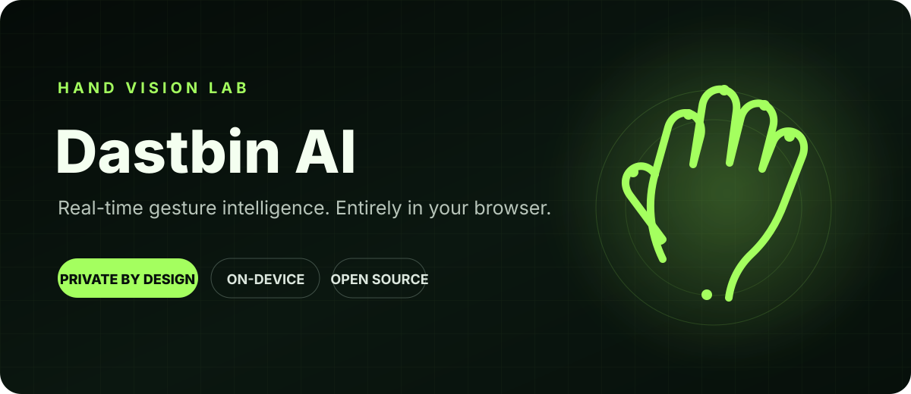
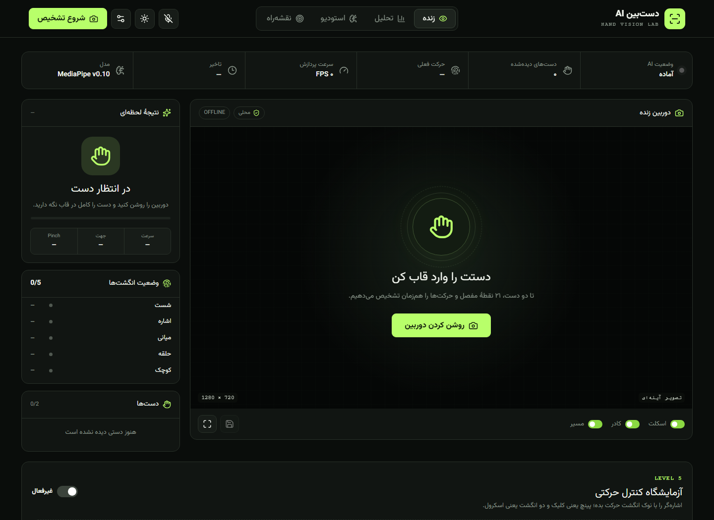
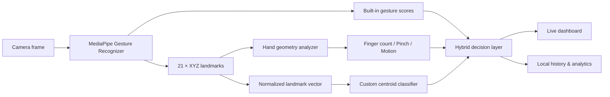

<div align="center">
  

  <br />

  <p>
    <strong>آزمایشگاه متن‌باز بینایی دست؛ سریع، خصوصی و کاملاً داخل مرورگر.</strong>
  </p>

  <p>
    <a href="#شروع-سریع">شروع سریع</a> ·
    <a href="#قابلیتها">قابلیت‌ها</a> ·
    <a href="#معماری">معماری</a> ·
    <a href="#english">English</a>
  </p>

  <p>
    
    
    
    
    
  </p>
</div>

---

## دست‌بین چیست؟

**دست‌بین AI** یک داشبورد بینایی ماشین برای رهگیری زندهٔ دست، تشخیص ژست و ساخت حرکت‌های سفارشی است. دوربین، مدل و استنتاج همگی داخل مرورگر اجرا می‌شوند؛ تصویر کاربر برای پردازش به سرور ارسال نمی‌شود.

این پروژه فراتر از یک دموی سادهٔ MediaPipe است: دو دست را هم‌زمان رهگیری می‌کند، ۲۱ نقطهٔ هر دست را رسم می‌کند، انگشت‌ها را می‌شمارد، ژست‌های ایستا و پویا را تشخیص می‌دهد، تاریخچه و سنجه‌های زنده می‌سازد و اجازه می‌دهد بدون بک‌اند یک طبقه‌بند ژست شخصی آموزش دهید.



## قابلیت‌ها

- رهگیری هم‌زمان حداکثر دو دست و ۲۱ landmark برای هر دست
- تشخیص دست چپ و راست، شمارش انگشت‌ها و ترسیم اسکلت، مفصل و Bounding Box
- ژست‌های آماده مانند Open Palm، Fist، Victory، Thumb Up/Down و I Love You
- تشخیص حرکات مشتق‌شده مانند Pinch، OK، Wave و Swipe در چهار جهت
- تحلیل سرعت، جهت حرکت، confidence، FPS، latency و زمان inference
- کنترل حرکتی داخل برنامه با اشاره‌گر، Pinch Click/Drag و فرمان‌های نمایشی
- استودیوی جمع‌آوری داده و آموزش طبقه‌بند Centroid با landmarkهای نرمال‌شده
- ذخیرهٔ محلی تنظیمات، تاریخچه، نمونه‌ها و مدل سفارشی با `localStorage`
- خروجی CSV، خروجی dataset و ثبت تصویر از نتیجهٔ تشخیص
- فرمان صوتی برای شروع، توقف و تغییر بخش‌های برنامه در مرورگرهای پشتیبان
- پوستهٔ روشن/تیره، انتخاب دوربین، رزولوشن، FPS هدف و آستانهٔ تشخیص
- runtime، فایل WASM و مدل از داخل همین پروژه سرو می‌شوند؛ پس اجرای اصلی به CDN وابسته نیست
- health endpoint در مسیر [`/api/health`](http://localhost:3000/api/health)

## حریم خصوصی، از ابتدا

دست‌بین برای پردازش اصلی به حساب کاربری، API key یا بک‌اند نیاز ندارد.

- فریم دوربین در همان مرورگر پردازش می‌شود.
- دادهٔ تصویری به سرور آپلود نمی‌شود.
- نمونه‌های ژست فقط شامل مختصات نرمال‌شدهٔ landmarkها هستند.
- تاریخچه، تنظیمات و مدل سفارشی در مرورگر خود کاربر باقی می‌مانند.
- مجوز دوربین فقط پس از اقدام مستقیم کاربر درخواست می‌شود.

> [!NOTE]
> مرورگر برای دسترسی به دوربین به `localhost` یا یک origin امن با HTTPS نیاز دارد.

## شروع سریع

### پیش‌نیازها

- Node.js `22.13` یا جدیدتر
- npm
- یک مرورگر مدرن با پشتیبانی از WebAssembly و `getUserMedia`
- دوربین، برای تست تشخیص زنده

### اجرا در محیط توسعه

```bash
npm ci
npm run dev
```

سپس [`http://localhost:3000`](http://localhost:3000) را باز کنید و روی «روشن کردن دوربین» بزنید.

### بررسی کیفیت پروژه

```bash
npm run check
npm run build
```

### اجرای build تولیدی

```bash
npm run build
npm start
```

## راهنمای استفاده

1. در بخش **زنده** دوربین را روشن کنید و دست را کامل داخل قاب نگه دارید.
2. از تنظیمات، camera، resolution، FPS و confidence threshold را تنظیم کنید.
3. برای ساخت ژست شخصی وارد **استودیو** شوید، نام حرکت را بنویسید و از زاویه‌های مختلف نمونه بگیرید.
4. با حداقل سه نمونه برای هر کلاس می‌توانید مدل را آموزش دهید؛ برای نتیجهٔ پایدار ۱۵ نمونه یا بیشتر پیشنهاد می‌شود.
5. در بخش **تحلیل** عملکرد زنده و تاریخچه را ببینید یا CSV دریافت کنید.

## معماری



هستهٔ pipeline در [`app/hand-vision.ts`](app/hand-vision.ts) قرار دارد. رابط، loop دوربین، overlay و ابزارهای analytics در [`app/page.tsx`](app/page.tsx) پیاده‌سازی شده‌اند. runtime محلی MediaPipe و مدل Gesture Recognizer از پوشهٔ `public/` بارگذاری می‌شوند.

## ساختار پروژه

```text
app/
  api/health/route.ts   Health endpoint
  hand-vision.ts        Feature extraction, motion analysis, custom model
  layout.tsx            Metadata and RTL document shell
  page.tsx              Dashboard and real-time camera pipeline
components/ui/          Reusable UI primitives
public/
  models/               Bundled gesture model
  vision/               MediaPipe runtime and WASM binaries
output/pdf/              Persian product and technical documents
docs/assets/             README artwork and product screenshot
```

## فرمان‌های npm

- `npm run dev` — اجرای محیط توسعه
- `npm run lint` — تحلیل ایستا با Oxlint
- `npm run typecheck` — بررسی TypeScript بدون تولید فایل
- `npm run format` — قالب‌بندی کد با Oxfmt
- `npm run format:check` — بررسی قالب‌بندی بدون تغییر فایل
- `npm run check` — اجرای lint، typecheck و format check
- `npm run build` — ساخت نسخهٔ production
- `npm start` — اجرای build با Wrangler

## مستندات فارسی

- [کاتالوگ محصول دست‌بین](output/pdf/hand-vision-catalog-fa.pdf)
- [راهنمای فنی معماری و پیاده‌سازی](output/pdf/hand-vision-technical-guide-fa.pdf)

## محدودیت‌های فعلی

- کیفیت تشخیص به نور، پس‌زمینه، فاصلهٔ دست و زاویهٔ دوربین وابسته است.
- مدل سفارشی فعلی یک طبقه‌بند سبک Centroid است؛ برای CNN، ONNX یا sequence model به pipeline جدا نیاز است.
- کنترل سیستم‌عامل از داخل مرورگر ممکن نیست؛ کنترل‌های فعلی در محدودهٔ خود برنامه‌اند.
- Speech Recognition در همهٔ مرورگرها در دسترس نیست.

## مشارکت

Issue و Pull Request خوش‌آمدند. قبل از ارسال تغییر، لطفاً [`CONTRIBUTING.md`](CONTRIBUTING.md) و [`SECURITY.md`](SECURITY.md) را بخوانید و `npm run check` را اجرا کنید.

## مجوز

کد پروژه تحت [MIT License](LICENSE) منتشر می‌شود. runtime، مدل و دارایی‌های شخص ثالث تابع مجوزهای upstream خود هستند؛ جزئیات در [`THIRD_PARTY_NOTICES.md`](THIRD_PARTY_NOTICES.md) آمده است.

---

<a id="english"></a>

## English

**Dastbin AI** is a privacy-first, real-time hand vision lab that runs entirely in the browser. It tracks up to two hands, recognizes static and dynamic gestures, visualizes 21 landmarks per hand, records local analytics, and trains lightweight custom gesture classes without a backend.

### Highlights

- On-device MediaPipe inference through WebAssembly
- Multi-hand tracking, finger state, bounding boxes and motion trails
- Built-in, derived and user-trained gesture recognition
- Live FPS, inference time, latency, confidence and history
- Local-only settings, samples and custom model persistence
- RTL Persian interface with dark and light themes
- React 19, TypeScript, Vinext/Vite and Cloudflare Workers tooling

To run it locally, install Node.js 22.13+, execute `npm ci && npm run dev`, and open `http://localhost:3000`. Camera access requires localhost or HTTPS.

If you find a bug or have an idea, please open an issue. Contributions are welcome.
